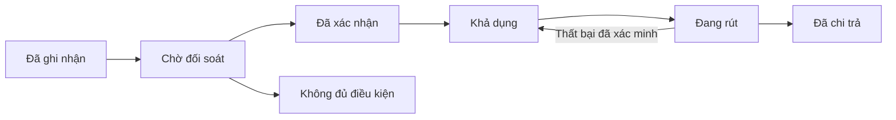

# Cashback Shopee — nghiên cứu và thiết kế sản phẩm

Ngày nghiên cứu: 24/09/2026. Trạng thái: đề xuất sản phẩm, chưa triển khai hoặc kiểm thử bằng tài khoản affiliate.

## 1. Định hướng đề xuất

Xây một website ưu tiên điện thoại giúp người dùng **dán link Shopee, xem tiền hoàn dự kiến, mua qua link theo dõi và theo dõi tiền hoàn đến khi được chi trả**. Phía vận hành có công cụ đối soát từng khoản, xử lý đơn chưa khớp và duyệt rút tiền.

Giả định định hướng B2C dựa trên tên dự án Cashback-Shopee; thư mục hiện chưa có mã nguồn để kế thừa. Đây là đề xuất thiết kế của dự án, không phải tính năng sẵn có của API hoặc cam kết của Shopee.

Lợi ích cốt lõi: người mua biết mình có thể được hoàn bao nhiêu và tiền đang ở bước nào. Độ tin cậy của việc ghi nhận và chi trả quan trọng hơn số lượng trang săn deal.

| Hướng sản phẩm | Giá trị | Quyết định đề xuất |
| --- | --- | --- |
| Website hoàn tiền cho người mua | Tiết kiệm và theo dõi tiền hoàn | Sản phẩm chính, mở sau khi kiểm chứng đối soát |
| Dashboard affiliate | Tổng hợp hiệu quả kênh và hoa hồng | Xây phần vận hành trước, dùng để xác minh dữ liệu |
| Công cụ chọn sản phẩm cho cộng tác viên | So sánh các link, chọn sản phẩm phù hợp | Mở rộng sau khi luồng chính ổn định |

## 2. Bằng chứng từ tài liệu

Các trang Addlivetag là tài liệu của bên thứ ba. Những trang mô tả GraphQL Shopee vẫn cần đối chiếu với quyền truy cập và schema của tài khoản thật. Trang tài liệu chính thức được mở nhưng không cung cấp nội dung schema trong công cụ đọc trang; chưa xác nhận độc lập các ví dụ đó.

| Nguồn | Điều đã đọc được | Ý nghĩa |
| --- | --- | --- |
| [Product Data](https://addlivetag.com/shopee-affiliate-api/product_data.php) | Tra theo URL/ID; thông tin sản phẩm, giá, đánh giá và hoa hồng | Làm màn hình xem trước sản phẩm |
| [GitHub Product Data](https://github.com/bcat95/shopee-aff/blob/main/product-data-api.md) | Cache khoảng 24 giờ; cảnh báo hạn chế link rút gọn; thống kê giá có thể thiếu; fallback vẫn có thể trả success | Cần thể hiện độ mới và thiếu dữ liệu |
| [Orders/items](https://addlivetag.com/shopee-affiliate-api/conversion_data.php#orders) | Orders gộp theo checkout, items theo sản phẩm; có commission, mcn_fee, utm/sub_id1 | Dùng items làm đầu vào đối soát |
| [Clicks](https://addlivetag.com/shopee-affiliate-api/conversion_data.php#clicks) | Có mã, thời điểm, nguồn và Sub ID của click | Phân tích kênh và kiểm tra hành trình |
| [Tạo link](https://addlivetag.com/shopee-affiliate-api/short_link.php) | Mô tả generateShortLink với tối đa năm subIds | Cần tích hợp thêm để phát hành link theo dõi |
| [Conversion report](https://addlivetag.com/shopee-affiliate-api/conversion_report.php) và [Validation report](https://addlivetag.com/shopee-affiliate-api/validation_report.php) | Mô tả báo cáo chuyển đổi và xác thực với Sub ID | Nguồn bổ sung cần kiểm chứng cho đối soát |
| [Product offers](https://addlivetag.com/shopee-affiliate-api/product_offer.php) | Mô tả tìm kiếm theo từ khóa/danh mục và sắp xếp ưu đãi | Nguồn bổ sung nếu làm trang khám phá |

REST conversion của Addlivetag dùng dữ liệu đã đồng bộ từ tài khoản affiliate kết nối bằng cookie; xác thực bằng API key, khuyến nghị header X-API-Key. Tài liệu nêu mức 60 request/phút/key, phân trang và lọc tài khoản/ngày. Vì vậy không xem đây là nguồn thời gian thực. Chỉ chủ hệ thống cần kết nối affiliate; người mua không cần cung cấp cookie Shopee. [Nguồn](https://addlivetag.com/shopee-affiliate-api/conversion_data.php)

Đọc được tài liệu không đồng nghĩa API đang hoạt động đúng như mô tả. Chưa có phản hồi nghiệp vụ thực tế bằng API key/App ID của dự án; lần đọc endpoint sản phẩm công khai qua công cụ web không lấy được phản hồi để xác minh.

## 3. Phạm vi tính năng

| Tính năng | Trải nghiệm | Phụ thuộc | Ưu tiên |
| --- | --- | --- | --- |
| Kiểm tra link | Dán link, thấy sản phẩm và mức hoàn dự kiến | Product Data và bộ chuẩn hóa URL | MVP |
| Mua có theo dõi | Đăng nhập, tạo phiên mua, chuyển tới Shopee | Dịch vụ tạo link và mã theo dõi riêng | MVP |
| Đơn của tôi | Xem từng khoản hoàn, trạng thái, lý do điều chỉnh | Đồng bộ và đối chiếu items | MVP |
| Số dư hoàn tiền | Tách đang chờ, khả dụng, đang rút và đã nhận | Sổ giao dịch nội bộ | MVP có điều kiện |
| Yêu cầu rút | Nhập số tiền, xem trạng thái xử lý | Quy trình chi trả, chứng từ | MVP duyệt thủ công |
| Báo thiếu đơn | Chọn lần mua, gửi yêu cầu kiểm tra | Nhật ký chuyển hướng và hệ thống hỗ trợ | MVP |
| Trang vận hành | Kiểm tra đơn chưa khớp, đồng bộ lỗi, duyệt chi | Quyền quản trị và nhật ký thay đổi | MVP |
| Danh sách yêu thích | Lưu sản phẩm đã tra cứu | Dữ liệu nội bộ | Sau MVP |
| Theo dõi biến động giá | Xem các mốc giá đã quan sát, đặt ngưỡng | Thu thập snapshot riêng theo thời gian | Sau MVP |
| Khám phá sản phẩm | Tìm theo từ khóa, lọc theo nhu cầu | Product offers hoặc danh mục tự tuyển chọn | Sau MVP |
| Hiệu quả cộng tác viên | Click, đơn, tiền thực nhận theo kênh | Mã kênh và quy tắc ghi nhận riêng | Sau MVP |
| ShopeeFood | Hành trình hoàn tiền riêng | Xác minh tracking và hoa hồng riêng | Ngoài MVP |

Không đưa vào lời hứa ban đầu: hoàn tiền tức thì, theo dõi tất cả đơn trong tài khoản Shopee của người mua, tự đặt hàng, tự áp voucher, giá/tồn kho trực tiếp, rút tiền tự động hoàn toàn. Những khả năng đó chưa được chứng minh bởi tài liệu đã đọc.

## 4. Luồng người mua

1. **Dán link:** cho phép tra cứu trước đăng nhập để giảm thao tác ban đầu.
2. **Xem kết quả:** ảnh, tên, shop, giá tham khảo, hoàn dự kiến và thời điểm dữ liệu được cập nhật.
3. **Bắt đầu mua:** đăng nhập trước khi tạo phiên mua có chủ sở hữu. Lưu chính sách hoàn áp dụng cho phiên đó.
4. **Mở Shopee:** tạo link affiliate của hệ thống, lưu mã theo dõi rồi chuyển người mua đi. Tách lỗi tạo link khỏi lỗi tra cứu sản phẩm.
5. **Chờ ghi nhận:** lần mở link hiện trong lịch sử mua; không tự tạo đơn chỉ vì có click.
6. **Đơn được đối chiếu:** hiện khoản hoàn đang chờ và lịch sử thay đổi.
7. **Đủ điều kiện:** khoản hoàn chuyển sang khả dụng sau đối soát và điều kiện cấp vốn của hệ thống.
8. **Rút tiền:** người dùng gửi yêu cầu, hệ thống giữ số dư tương ứng; vận hành kiểm tra và xác nhận chi trả theo chứng từ.

Một phiên mua có thể được báo cáo với nhiều dòng sản phẩm. Quy tắc áp dụng cho sản phẩm khác trong cùng phiên cần được công bố và kiểm thử, không suy ra tự động từ sản phẩm người dùng đã dán.

### Năm màn hình cho người dùng

| Màn hình | Nội dung chính | Hành động chính |
| --- | --- | --- |
| Trang chủ | Ô dán link, hướng dẫn ba bước, lần tra gần đây | Kiểm tra tiền hoàn |
| Kết quả | Sản phẩm, mức hoàn dự kiến, điều kiện, độ mới dữ liệu | Mua để nhận hoàn tiền |
| Đơn của tôi | Bộ lọc, khoản hoàn từng dòng, lịch sử trạng thái | Xem chi tiết / báo thiếu đơn |
| Tiền hoàn | Các loại số dư, lịch sử điều chỉnh và chi trả | Yêu cầu rút |
| Tài khoản & hỗ trợ | Thông tin nhận tiền, yêu cầu hỗ trợ | Cập nhật / gửi yêu cầu |

Thanh điều hướng điện thoại: **Trang chủ · Đơn hàng · Tiền hoàn · Tài khoản**. Chỉ hiển thị một hành động chính trên màn hình kết quả. Không dùng thuật ngữ commission, API hay Sub ID trong luồng mua.

### Trạng thái giao diện cần thiết

| Trường hợp | Cách hiển thị |
| --- | --- |
| Đang tra cứu | Trạng thái tải và nút tạm khóa chống bấm lặp |
| Link không hợp lệ | “Hãy dán link sản phẩm Shopee.” |
| Không mở rộng được link ngắn | “Chưa đọc được link này. Bạn có thể dùng link đầy đủ của sản phẩm.” |
| Thiếu dữ liệu hoa hồng | “Chưa xác định được tiền hoàn.” Không hiển thị 0 đồng như một kết luận |
| Giá cũ | Hiện thời điểm cập nhật; dùng nhãn “Giá tham khảo” |
| Đã chuyển tới Shopee | “Đã lưu lần mua; đang chờ báo cáo ghi nhận.” |
| Chưa thấy đơn | Hiện lần đồng bộ thành công và nút yêu cầu kiểm tra |
| Đơn bị điều chỉnh | Hiện số cũ, số mới, thời gian và lý do có căn cứ |

## 5. Ghi nhận đúng người và đúng đơn

Thiết kế đề xuất: tạo một `tracking_token` ngẫu nhiên, không chứa email/số điện thoại. Lưu quan hệ token → user → phiên mua → tài khoản affiliate → phiên bản chính sách. Gắn token vào subId đầu tiên khi tạo link; dùng các vị trí khác cho kênh và chiến dịch nếu hợp đồng API cho phép.

Phải thử nghiệm việc token đi hết vòng tạo link → click → báo cáo dòng hàng. Không giả định `subIds`, `sub_id1`, `sub_id` và `utm` có cùng cách mã hóa. Chỉ token được đối chiếu chắc chắn mới cho phép gán khoản hoàn tự động. Không ghép người mua dựa trên cùng sản phẩm, giá và thời gian gần nhau.

Các trường hợp thiếu token, token không tồn tại, nhiều ứng viên hoặc khóa dòng không rõ phải vào hàng chờ đối soát. Một đơn do người dùng tự khai không đủ để phát sinh số dư.

Link mua cá nhân thuộc về phiên của người đã đăng nhập. MVP không quảng bá khả năng chia sẻ link cá nhân để người khác mua nhận hoàn. Nếu mở chương trình giới thiệu, cần một loại link và cơ chế phân chia riêng.

## 6. Chính sách tiền hoàn và sổ giao dịch

Đề xuất chính sách thử nghiệm: chia một tỷ lệ của **hoa hồng ròng đủ điều kiện** cho người mua; tỷ lệ, trần, cách làm tròn và phiên bản chính sách được lưu tại thời điểm tạo phiên mua.

```text
Tiền hoàn dự kiến = làm_tròn_xuống(hoa_hồng_ước_tính_đã_chuẩn_hóa × tỷ_lệ_chia)
Tiền hoàn xác nhận = làm_tròn_xuống(hoa_hồng_ròng_đủ_điều_kiện × tỷ_lệ_đã_lưu)
```

Ví dụ giả lập: cơ sở hoa hồng dự kiến 20.000đ, chia 70% → hiển thị dự kiến 14.000đ. Khi đối soát, cơ sở ròng đủ điều kiện là 18.000đ → xác nhận 12.600đ. Phần còn lại 5.400đ còn phải trang trải chi phí; chưa phải lợi nhuận. Tỷ lệ 70% chỉ để minh họa.

Phải xác định rõ cơ sở hoa hồng của từng nguồn đã bao gồm thuế, phí MCN và tỷ lệ tài khoản hay chưa. Không tự động lấy commission trừ mcn_fee, cũng không mặc định commission công khai là số dự án sẽ nhận. Khi chưa xác minh cơ sở tính, chỉ thử nghiệm báo giá nội bộ.

Các trạng thái nội bộ dưới đây là đề xuất, không phải mã trạng thái API:



- **Đã xác nhận**: số tiền và điều kiện đã đối soát; không tự động đồng nghĩa đã nhận tiền từ đối tác.
- **Khả dụng**: khoản hoàn được cấp vốn theo chính sách của dự án. MVP đề xuất chỉ mở sau khi xác nhận nguồn tiền tương ứng.
- **Đang rút**: đã giữ số dư để tránh rút hai lần. Nếu kết quả chuyển tiền chưa rõ, tiếp tục giữ và kiểm tra, không tự động gửi lại.
- **Đã chi trả**: có chứng từ/mã giao dịch, không chỉ dựa vào thao tác bấm nút.
- **Điều chỉnh sau xác nhận**: tạo bút toán bù có tham chiếu, không sửa/xóa lịch sử; nếu đã chi trả thì chuyển đối soát thủ công.

Số dư được tính từ sổ giao dịch bất biến. Không cộng dồn mỗi lần quét lại API. Mỗi nguồn dữ liệu và sự kiện chi trả cần khóa chống ghi nhận lặp.

## 7. Thiết kế vận hành và dữ liệu

### Kiến trúc đề xuất

```text
Website điện thoại
    → Backend: tài khoản, tra cứu, báo giá, phiên mua, chuyển hướng
    → Adapter: Product Data / tạo affiliate link / báo cáo conversion
    → Worker: đồng bộ, chuẩn hóa, đối chiếu, kiểm tra thay đổi
    → Database: snapshot, đơn, chính sách, sổ giao dịch, yêu cầu rút
    → Admin: chất lượng dữ liệu, đối soát ngoại lệ, duyệt chi
```

API key, App Secret và kết nối tài khoản chỉ nằm phía máy chủ. Adapter giúp thay nguồn mà không đổi quy tắc tiền hoàn. Nếu dùng Addlivetag, quyền truy cập và luồng cookie thuộc cấu hình của chủ dự án; cần quyết định rõ trước khi kết nối tài khoản.

| Đối tượng nội bộ | Dữ liệu tối thiểu |
| --- | --- |
| User | ID nội bộ, trạng thái tài khoản |
| Affiliate account | Nhà cung cấp, mã tài khoản, tham chiếu bí mật, trạng thái đồng bộ |
| Product snapshot | Sản phẩm, giá/hoa hồng tham khảo, thời điểm nguồn, thời điểm lấy |
| Purchase session | User, token, affiliate account, sản phẩm đầu vào, link đã tạo |
| Cashback policy snapshot | Tỷ lệ, cơ sở tính, trần, quy tắc làm tròn, phiên bản |
| Conversion item | Khóa dòng nguồn, khóa đơn/checkout, tiền, trạng thái gốc, token |
| Ledger entry | Số tiền, loại bút toán, tham chiếu gốc, khóa chống lặp |
| Withdrawal | Số tiền giữ, trạng thái, chứng từ, người duyệt |
| Sync run / support case | Cửa sổ đồng bộ, lỗi, tiến độ; yêu cầu kiểm tra |

Tên trường trên là mô hình nội bộ. Đặc biệt `source_line_id`/khóa dòng chưa được tài liệu REST mô tả đầy đủ: phải lấy payload mẫu và xác minh. Không dùng riêng order + item làm khóa khi có nhiều biến thể/dòng trùng sản phẩm. Lưu ID nguồn dạng chuỗi để tránh mất chính xác số nguyên lớn.

### Quy tắc đồng bộ đề xuất

- Chạy worker tập trung; giao diện đọc dữ liệu đã lưu, không quét nhà cung cấp mỗi lần mở trang.
- Lịch khởi đầu có thể 15–30 phút, chỉ là cấu hình thử nghiệm; điều chỉnh theo độ trễ nguồn đo được và số trang cần đọc.
- Giới hạn request theo ngân sách chung của key; retry có backoff khi quá tải, không lặp vô hạn.
- Đọc hết phân trang trước khi đánh dấu một cửa sổ hoàn thành. Lưu checkpoint, timestamp nguồn và timestamp nhận.
- Quét lại khoảng thời gian chồng lấn, tiếp tục tái kiểm tra các khoản chưa kết thúc. Khoảng hồi cứu phụ thuộc thời gian nhà cung cấp còn điều chỉnh đơn.
- Chuẩn hóa đơn vị tiền, múi giờ và mã trạng thái riêng cho từng nguồn. Không dùng mã trạng thái của GraphQL để diễn giải REST.
- Báo cáo thiếu dòng không có nghĩa đơn bị hủy. Chỉ đổi trạng thái theo bằng chứng rõ hoặc đưa vào đối soát.
- Phân biệt checkout, đơn, dòng sản phẩm và số lượng; không cộng summary mỗi trang hoặc cộng cả orders lẫn items.

### Trang admin

Ưu tiên bốn hàng chờ: **đơn chưa gắn được người dùng; dữ liệu nguồn chưa rõ; khoản đã xác nhận chờ cấp vốn; yêu cầu rút chờ xử lý**. Mỗi thao tác ảnh hưởng tiền phải lưu người thực hiện, thời điểm, lý do và tham chiếu.

Dashboard hiển thị click chuyển đi của website và click do đối tác ghi nhận thành hai chỉ số riêng. Nếu tính tỷ lệ chuyển đổi theo ngày, ghi rõ đây là chỉ số cùng kỳ; chỉ tính theo nhóm click khi có dữ liệu nối chính xác. Hoa hồng ước tính và hoa hồng đã xác nhận không cộng làm doanh thu thực nhận.

## 8. Các điều kiện quyết định có thể mở hoàn tiền thật

| Câu hỏi chưa được giải quyết | Cách kiểm chứng | Nếu chưa đạt |
| --- | --- | --- |
| Tài khoản được phép vận hành mô hình hoàn tiền này? | Xác nhận điều kiện hiện hành cho chính tài khoản và mô hình dự án | Chỉ chạy nội bộ, chưa hứa trả hoàn |
| Có quyền tạo link của đúng affiliate account? | Tạo link thử bằng quyền dự án và kiểm tra đích | Chưa mở nút mua có cam kết hoàn |
| Sub ID có đi nguyên vẹn qua báo cáo? | Theo dõi giao dịch hợp lệ được chủ tài khoản cho phép | Chưa tự gán tiền cho người dùng |
| Đâu là khóa duy nhất từng dòng và cách mã hóa trạng thái? | Đọc payload thật, gồm nhiều dòng/biến thể, thay đổi trạng thái | Chưa tự động đối soát |
| Hoa hồng ròng và phí được biểu diễn thế nào? | So khớp mẫu với đối soát của tài khoản | Chưa quyết định mức hoàn thật |
| Có chứng cứ xác nhận và nguồn tiền để chi trả? | Xác định báo cáo cuối kỳ, chứng từ và quy tắc cấp vốn | Chưa chuyển khoản hoàn sang khả dụng |
| Dữ liệu chậm bao lâu, cookie hết hạn báo thế nào? | Đo trong thử nghiệm và mô phỏng lỗi kết nối | Chưa công bố SLA ghi nhận |

Không cần cung cấp bí mật để tiếp tục thiết kế. Giai đoạn tích hợp cần tài khoản thử/quyền truy cập phù hợp và payload đã loại bỏ thông tin nhạy cảm.

## 9. Lộ trình có tiêu chí nghiệm thu

### Giai đoạn A — chứng minh luồng dữ liệu

Hoàn thành adapter thử nghiệm, dashboard đối soát tối thiểu, tạo link, kiểm tra vòng token và mapping tiền/trạng thái. Bộ tình huống gồm đơn thành công, bị từ chối, thay đổi số tiền, nhiều dòng cùng sản phẩm, thiếu token, API lỗi và dữ liệu đến muộn. Không mua hàng hoặc chuyển tiền tự động để tạo dữ liệu kiểm thử.

**Điều kiện qua giai đoạn:** có hợp đồng dữ liệu xác minh được cho danh tính dòng hàng, attribution và cơ sở hoa hồng; biết rõ nguồn xác nhận cuối cùng.

### Giai đoạn B — MVP kín

Triển khai năm màn hình người mua, bảng admin, sổ giao dịch, báo thiếu đơn và rút tiền có duyệt. Chọn nhóm người dùng thử nhỏ theo năng lực hỗ trợ thực tế.

**Điều kiện qua giai đoạn:** nhập lại cùng báo cáo không tăng tiền; hai yêu cầu rút đồng thời không dùng trùng số dư; không gán nhầm người; mỗi khoản khả dụng truy được đến bằng chứng; tình huống thanh toán chưa rõ không gây gửi tiền lặp.

### Giai đoạn C — tăng trưởng

Sau khi đo được tỷ lệ ghi nhận, thời gian đối soát và chi phí mỗi người dùng, bổ sung yêu thích, nhắc giá, trang ưu đãi tuyển chọn và báo cáo kênh. Chỉ mở tự động hóa chi trả khi có cơ chế kiểm tra trạng thái và chống gửi lặp của hệ thống thanh toán.

**Chỉ số theo dõi:** tỷ lệ tra cứu thành công; tạo link thành công; từ tra cứu sang bắt đầu mua; tỷ lệ dòng hàng có token hợp lệ; độ trễ ghi nhận trung vị/P95; tỷ lệ điều chỉnh; yêu cầu thiếu đơn; thời gian xử lý rút; chi phí hỗ trợ; người dùng quay lại; phần hoa hồng còn lại sau hoàn tiền và chi phí. Đặt mục tiêu số sau khi có đường cơ sở từ thử nghiệm.

## 10. Quyết định chốt cho bản thiết kế này

MVP gồm **dán link + báo giá hoàn dự kiến + tạo phiên mua + theo dõi đơn + số dư + yêu cầu rút + đối soát admin**. Cơ chế chi trả chỉ kích hoạt khi các điều kiện ở mục 8 đã được kiểm chứng. Phát triển phần đối soát trước hoặc cùng trải nghiệm người mua, vì đó là điều kiện để lời hứa hoàn tiền có thể thực hiện được.
