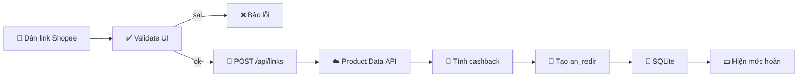
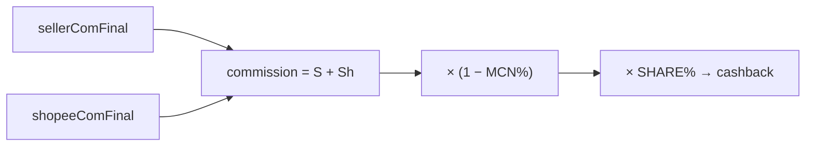
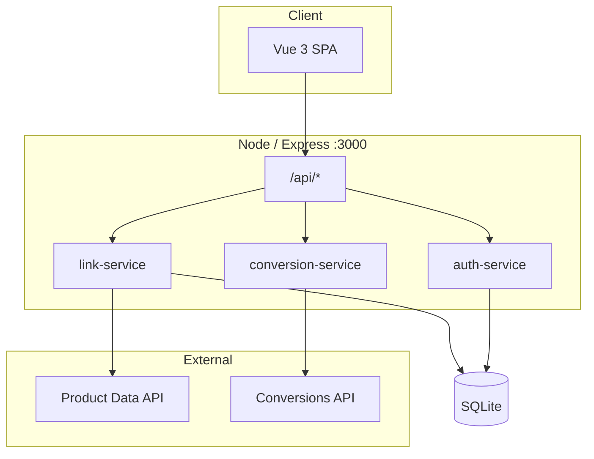

<div align="center">

# ◓ MOONLINK

**Công cụ chuyển link Shopee → link affiliate & tra mức hoàn dự kiến**

Dán link sản phẩm · Chạm mặt trăng · Biết ngay được hoàn bao nhiêu

<br/>

[](https://nodejs.org/)
[](https://vuejs.org/)
[](https://vitejs.dev/)
[](https://expressjs.com/)
[](https://sqlite.org/)
[](https://pnpm.io/)
[](./LICENSE)

<br/>

[🚀 Tính năng](#-điểm-nổi-bật) ·
[🛠️ Công nghệ](#️-công-nghệ) ·
[⚙️ Cài đặt](#️-cài-đặt) ·
[🗺️ Kiến trúc](#️-sơ-đồ-kiến-trúc--luồng-hoạt-động) ·
[🔑 API Key](#-hướng-dẫn-lấy-api-key--affiliate-id) ·
[🌐 API](#-api-nội-bộ) ·
[🔒 Bảo mật](#-bảo-mật) ·
[📄 License](#-giấy-phép)

<br/>


</div>

---

## 🚀 MOONLINK là gì?

**MOONLINK** là web app **self-host / open source** giúp:

- 🛍️ **Dán link sản phẩm Shopee** → nhận **link affiliate** (`an_redir` chuẩn 2026)
- 💰 **Xem mức hoàn dự kiến** (`cashback`) trước khi mua
- 📊 **Admin dashboard**: link đã tạo, đơn hàng, click, biểu đồ

### 📡 Dữ liệu từ đâu?

Dự án dùng **API không chính thống** (unofficial) của [Addlivetag](https://addlivetag.com/) để lấy **thông tin sản phẩm Shopee kèm chi tiết hoa hồng (commission)** — gồm:

| Trường | Ý nghĩa |
| --- | --- |
| `productName`, `price`, `imageUrl` | Thông tin sản phẩm |
| `sellerComFinal` | Hoa hồng shop (Xtra) — sau user rate & tax |
| `shopeeComFinal` | Hoa hồng sàn Shopee — sau cap 40k & 8% giá |
| `commission` | Tổng hoa hồng = `sellerComFinal + shopeeComFinal` |

> ⏳ **Dữ liệu được cache trong database ~24 giờ** trước khi làm mới.  
> Có thể **không chính xác 100%** so với dashboard Shopee tại thời điểm bạn xem — chỉ mang tính **tham khảo**.

> ⚠️ **Không phải app “trả tiền hoàn tự động”.**  
> Code chỉ *ước tính* mức hoàn và *tạo link theo dõi*. Việc chi trả do bạn tự vận hành.

---

## ✨ Điểm nổi bật

- 🌙 **Giao diện “mặt trăng”** — hiệu ứng tên lửa bay vòng khi kiểm tra link
- ✅ **Chặn link sai** ngay trên UI **và** server (không phải SP, ShopeeFood, link rác…)
- 💵 **Số tiền hoàn to, rõ ràng** — không nhồi thuật ngữ kỹ thuật vào mặt người dùng
- 🔗 **Link `an_redir` thật** — đúng policy Shopee 2026 (`origin_link` + `affiliate_id` + `sub_id`)
- 📈 **2 tab báo cáo** + biểu đồ + bộ lọc ngày/nguồn/trạng thái
- 🔐 **Login admin cứng** — scrypt, cookie HttpOnly, khóa 5 lần sai
- 📦 **Chỉ cần Node 22.5+** — SQLite native, không cài DB server
- 🪵 **Log debug** `[HTTP]` / `[DB]` / `[OUTBOUND]` khi dev
- 📡 **Không cần API Shopee chính thức** — dùng API không chính thống, ai cũng tự host được

---

## 🎯 Phù hợp với ai?

- 🙋‍♀️ **Người làm Shopee Affiliate nhưng không đăng ký được API chính thức của Shopee** — dùng API không chính thống để tra SP + hoa hồng + tạo link
- 👤 Người muốn **tự host** tool tạo link affiliate / cashback
- 👨‍💻 Dev cần **codebase nhỏ, dễ đọc** (Vue 3 + Express, không framework nặng)
- 🏪 Shop / KOL cần **tra nhanh mức hoàn** trước khi share link
- 🧑‍🔬 Người muốn **nghiên cứu API** Addlivetag / Shopee Affiliate

---

## 🛠️ Công nghệ

| Tầng | Stack |
| --- | --- |
| **Frontend** | Vue 3 · Vite 7 · CSS thuần (chart + animation) |
| **Backend** | Node.js 22.5+ · Express 5 · native `fetch` |
| **Database** | `node:sqlite` → `data/moonlink.sqlite` |
| **Auth** | `node:crypto` scrypt · cookie HttpOnly / SameSite=Strict |
| **API ngoài** | [Addlivetag](https://addlivetag.com/) — Product Data & Conversions |
| **Tracking** | `an_redir` (`s.shopee.vn/an_redir`) |
| **Tooling** | pnpm · concurrently · node --watch |

**Không dùng:** ORM · Redis · Vue Router · UI kit · chart library.

---

## ⚙️ Cài đặt

### 1️⃣ Yêu cầu

| Thành phần | Phiên bản |
| --- | --- |
| Node.js | **≥ 22.5** (bắt buộc — `node:sqlite`) |
| pnpm | ≥ 9 |
| OS | Windows / macOS / Linux |

```bash
node -v   # cần v22.5+
```

### 2️⃣ Clone & cài dependency

```bash
git clone https://github.com/babyvibe/Cashback-Shopee.git
cd Cashback-Shopee
pnpm install
```

### 3️⃣ Cấu hình `.env`

```bash
# Linux / macOS
cp .env.example .env

# Windows PowerShell
copy .env.example .env
```

Điền **tối thiểu** (chi tiết ở [mục API key](#-hướng-dẫn-lấy-api-key--affiliate-id)):

```env
ADDLIVETAG_API_KEY=xxxxxxxx
SHOPEE_AFFILIATE_ID=17330450011
ADMIN_USERNAME=admin
ADMIN_PASSWORD=MatKhauManh#2026
```

### 4️⃣ Chạy dev

```bash
pnpm dev
```

| URL | Mục đích |
| --- | --- |
| <http://127.0.0.1:5173> | Trang người dùng |
| <http://127.0.0.1:5173/#/admin> | Quản trị |
| <http://127.0.0.1:3000/api/health> | API health |

### 5️⃣ Build production

```bash
pnpm build    # → dist/
pnpm start    # backend Express
pnpm check    # check syntax server
```

<details>
<summary><b>🐳 Deploy gợi ý (nginx + HTTPS)</b></summary>

```nginx
server {
  listen 443 ssl;
  server_name moonlink.example.com;

  location / {
    root /var/www/moonlink/dist;
    try_files $uri /index.html;
  }

  location /api {
    proxy_pass http://127.0.0.1:3000;
    proxy_set_header Host $host;
    proxy_set_header X-Real-IP $remote_addr;
  }
}
```

Khi deploy HTTPS nhớ đặt `COOKIE_SECURE=1` trong `.env`.

</details>

---

## 🗺️ Sơ đồ kiến trúc & luồng hoạt động

### 1️⃣ Luồng kiểm tra link (người dùng)



### 2️⃣ Công thức hoàn tiền



> 📘 Theo docs: `commission = sellerComFinal + shopeeComFinal`  
> (sau user rate & tax; phần sàn đã cap 40k & 8% giá).  
> **Cashback = policy chia của bạn** — API không sinh sẵn số này.

### 3️⃣ Kiến trúc runtime



### 4️⃣ Link `an_redir` (chuẩn 2026)

```text
https://s.shopee.vn/an_redir
  ?origin_link=<URL SP đã encode, KHÔNG dính utm_*>
  &affiliate_id=<ID affiliate của bạn>
  &sub_id=sub1-sub2-sub3-sub4-sub5
```

> ❗ Sai / thiếu `affiliate_id` → **không ghi nhận hoa hồng**.

---

## 🔑 Hướng dẫn lấy API Key & Affiliate ID

Hai giá trị **bắt buộc** để app chạy dữ liệu thật:

| Biến `.env` | Lấy ở đâu |
| --- | --- |
| `ADDLIVETAG_API_KEY` | [addlivetag.com](https://addlivetag.com/) |
| `SHOPEE_AFFILIATE_ID` | Dashboard Shopee Affiliate của bạn |

### 1️⃣ Tài khoản Addlivetag

1. Vào **[https://addlivetag.com/](https://addlivetag.com/)** → đăng ký / đăng nhập.
2. *(Để xem báo cáo đơn/click)* Liên kết **cookie Shopee Affiliate** tại mục conversion accounts và **bật đồng bộ**.

### 2️⃣ Lấy `ADDLIVETAG_API_KEY`

1. Trong Addlivetag → mục **API Key / Tạo Key** (hoặc trang tool conversion).
2. Bấm **Tạo Key** → copy chuỗi ~48 ký tự hex.
3. Dán vào `.env`:

```env
ADDLIVETAG_API_KEY=chuoi_key_cua_ban
```

**Test key nhanh:**

```bash
curl -s "https://data.addlivetag.com/product-data/product-data.php?item_id=1589295236" \
  -H "X-API-Key: ADDLIVETAG_API_KEY_CUA_BAN"
```

Trả JSON có `productInfo` → OK.

> 📌 Key gửi qua header **`X-API-Key`**.  
> Product Data *có thể* chạy không key ở rate thấp, nhưng **từ 01/10/2026 bắt buộc có key**.  
> 🕐 **Cache ~24h** — giá / hoa hồng có thể lệch nhẹ so với thời điểm thực; dùng làm **tham khảo**.

### 3️⃣ Lấy `SHOPEE_AFFILIATE_ID`

1. Vào dashboard **Shopee Affiliate** (KOL / Publisher / Network bạn đang tham gia).
2. Tìm **Affiliate ID** / **Publisher ID** (chuỗi số).
3. Hoặc tạo 1 link affiliate bất kỳ rồi soi tham số `affiliate_id=` trên URL.

```env
SHOPEE_AFFILIATE_ID=17330450011
```

### 4️⃣ *(Tùy chọn)* Rate hoa hồng riêng

Nếu tài khoản bạn có tỷ lệ khác mặc định API:

```env
SHOPEE_BASE_RATE=8
SHOPEE_CAP_RAW=40000
```

---

## 🌐 API nội bộ

Base URL: `http://127.0.0.1:3000` (Vite proxy `/api`)

### Endpoint

| Method | Path | Auth | Mô tả |
| --- | --- | --- | --- |
| `GET` | `/api/health` | — | Trạng thái cấu hình |
| `POST` | `/api/links` | — | Chuyển link → affLink + cashback |
| `GET` | `/api/links/recent` | session | Lịch sử theo phiên |
| `DELETE` | `/api/links/recent` | session | Xóa lịch sử |
| `POST` | `/api/admin/login` | Origin check | Đăng nhập admin |
| `POST` | `/api/admin/logout` | cookie | Đăng xuất |
| `GET` | `/api/admin/me` | cookie | Phiên hiện tại |
| `GET` | `/api/admin/reports/stats` | cookie | Thống kê link |
| `GET` | `/api/admin/reports/links` | cookie | Link đã tạo |
| `GET` | `/api/admin/reports/conversions` | cookie | Báo cáo đơn / click |

### POST `/api/links`

**Request**

| Trường | Kiểu | Bắt buộc | Mô tả |
| --- | --- | --- | --- |
| `url` | string | ✅ | Link SP Shopee |
| `subIds` | string[] | | Tối đa 5 sub_id |

```bash
curl -X POST http://127.0.0.1:3000/api/links \
  -H "Content-Type: application/json" \
  -d '{"url":"https://shopee.vn/product/1388112438/28932551190","subIds":["web","demo"]}'
```

**Response `201`**

```json
{
  "ok": true,
  "link": {
    "productName": "Áo Thun Polo …",
    "productPrice": 179000,
    "commissionEstimate": 19690,
    "cashbackEstimate": 13783,
    "cashbackSharePercent": 70,
    "affiliateUrl": "https://s.shopee.vn/an_redir?origin_link=…&affiliate_id=…",
    "originUrl": "https://shopee.vn/product/1388112438/28932551190"
  }
}
```

**Error `400`**

```json
{ "ok": false, "message": "Hãy dán link một sản phẩm cụ thể trên Shopee." }
```

---

## 🔐 Bảo mật

| Lớp | Cơ chế |
| --- | --- |
| 🔑 Mật khẩu | **scrypt** + salt · `timingSafeEqual` |
| 🍪 Phiên | Cookie **HttpOnly + SameSite=Strict** · token lưu **SHA-256** |
| 🚫 Dò mật khẩu | **5 lần sai / 15 phút** → khóa 15 phút · rate-limit IP |
| 🛡️ CSRF | Check **Origin/Referer** khi login |
| 🔒 Secret | API key chỉ ở **server** (`.env`) |
| 🧱 HTTP header | `X-Frame-Options` · `no-store` cho admin |

**Production checklist**

- [ ] HTTPS + `COOKIE_SECURE=1`
- [ ] `ADMIN_PASSWORD` mạnh
- [ ] Không commit `.env`
- [ ] Backup `data/moonlink.sqlite`

---

## 🪵 Log debug

```text
[HTTP]    INFO  POST /api/links → 201 (412ms)
[OUTBOUND] INFO addlivetag:product-data GET https://data.addlivetag.com/… → 200 (380ms)
[DB]      INFO  INSERT generated_links rows=1 (2ms)
```

| Tag | Ý nghĩa |
| --- | --- |
| `[HTTP]` | Request → Express |
| `[DB]` | Thao tác SQLite |
| `[OUTBOUND]` | Gọi Addlivetag (đã che API key) |

- Bật/tắt: `LOG_API=1` / `LOG_API=0` (mặc định ON khi dev)

---

## 🧩 Cấu trúc dự án

```text
Cashback-Shopee/
├── server/                      # Backend Express
│   ├── index.js                 # Route /api/*
│   ├── db.js                    # SQLite schema
│   └── services/
│       ├── env.js               # Đọc .env
│       ├── url-service.js       # Validate link Shopee
│       ├── affiliate-provider.js# Product Data + an_redir
│       ├── link-service.js      # Tạo link + cashback
│       ├── conversion-service.js# Đơn / click
│       ├── auth-service.js      # Login admin
│       └── logger.js            # Log HTTP/DB/OUTBOUND
│
├── src/                         # Frontend Vue
│   ├── App.vue                  # Trang chủ + #/admin
│   ├── components/              # MoonButton, LinkResultCard…
│   ├── admin/                   # Login + Reports
│   ├── services/api.js          # fetch wrapper
│   └── styles*.css
│
├── data/moonlink.sqlite         # DB (gitignore)
├── .env.example
├── PRODUCT-DESIGN.md            # Tài liệu thiết kế
└── README.md
```

---

## ⚠️ Xử lý lỗi thường gặp

| Thông báo | Cách sửa |
| --- | --- |
| `Không kết nối được máy chủ` | Chạy `pnpm dev` |
| `Chưa cấu hình ADDLIVETAG_API_KEY` | Điền key vào `.env` |
| `Chưa cấu hình SHOPEE_AFFILIATE_ID` | Điền affiliate ID |
| Số liệu khác dashboard Shopee | API cache ~24h — chỉ tham khảo |
| `Hãy dán link một sản phẩm cụ thể` | Link phải có `item_id` |
| `Link ShopeeFood chưa hỗ trợ` | Chỉ nhận link SP (không phải food) |
| `Tạm khóa … giây` | Sai mật khẩu 5 lần — chờ hết khóa |
| SQLite `database is locked` | Tắt process cũ đang giữ DB |

**Reset khóa login:**

```bash
node -e "import('./server/services/auth-service.js').then(m => console.log(m.clearAllLoginLocks()))"
```

---

## 📣 Liên hệ

- 🐛 Báo lỗi / góp ý: [GitHub Issues](../../issues)
- 📄 Thiết kế sản phẩm: [PRODUCT-DESIGN.md](./PRODUCT-DESIGN.md)

---

## 🙏 Lời cảm ơn

- [Addlivetag](https://addlivetag.com/) — tài liệu & API Shopee Affiliate
- [bcat95/shopee-aff](https://github.com/bcat95/shopee-aff) — tham chiếu Product Data API
- Shopee Affiliate — hệ sinh thái publisher

---

## 📝 Giấy phép

Distributed under the **MIT License**. Xem [LICENSE](./LICENSE) để biết thêm chi tiết.

```
MIT License — free to use, modify, distribute
with attribution. No warranty.
```
